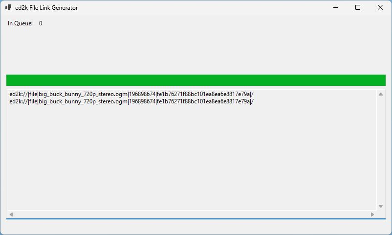

# ed2k generator utility

Windows GUI application for simple drag+drop file ed2k hash-link generating.

The anime database [AniDB](https://anidb.net/) uses ed2k hash-links to uniquely identify files.
Generating ed2k links from files eases managing your own list of files, their states, as well as contributing information to AniDB.

I found other utilities to be a hassle to set up or use, and the sources unapproachable when they were available.
With a technical interest in what ed2k-hashing does, I created this simple file-drag-and-drop utility in .NET 8, C#, WinForms.

## References / Implementation Notes

http://wiki.amule.org/t/index.php?title=MD4_hash

ed2k hash is based on/uses MD4. the algorithm for computing ed2k hash is as follows:

1. split the file into blocks of 9728000 bytes
2. compute MD4 hash digest of each file block separately
3. concatenate the list of block digests into one big byte array
4. compute MD4 of array created in step #3. this is the ed2k hash.

[MD4 - RFC 6150](https://www.rfc-editor.org/rfc/rfc6150)

MD4 - RFC 6150, RFC 1320, RFC 1186

* [RFC 6150](https://www.rfc-editor.org/rfc/rfc6150) *(retires MD4 as historic, obsoletes RFC 1320)*
* [RFC 1320](https://www.rfc-editor.org/rfc/rfc1320) *(obsoletes RFC 1186)*
* [RFC 1186](https://www.rfc-editor.org/rfc/rfc1186)

