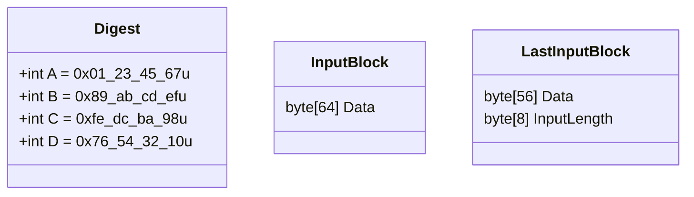

# RFC 1186 MD4

The MD4 message digest algorithm provides a *fingerprint* or *message digest* of a message of arbitrary length.

## Overview

Bit-based.




1. input + bit 1
1. pad right with bit 0 until multiple of 64 byte - 8 byte (8 byte end reserved for original input bit length)

## Condensed Logic

byte[] --MD4--> 16 byte (32 hex chars)

Work values: A, B, C, D; int (4 byte)

Result A,B,C,D; 16 byte, 128-bit, 32 hex chars

```
// init
A = 0x01_23_45_67u
B = 0x89_ab_cd_efu
C = 0xfe_dc_ba_98u
D = 0x76_54_32_10u

// prep input
input, pad right bit 1, pad right bits 0 until value-bit-count % (512 - 64)
```

input, pad right 1 bit 1, pad right bits 0 until len multiple of 64 byte - 8 byte

## Example

Empty data.

```
                                                                                                              1          1          1          1          1          1          1          1          1          1          2          2          2          2          2          2
           1          2          3          4          5          6          7          8          9          0          1          2          3          4          5          6          7          8          9          0          1          2          3          4          5
01234567 89012345 67890123 45678901 234567890123456789 0123456789 0123456789 0123456789 0123456789 0123456789 0123456789 0123456789 0123456789 0123456789 0123456789 0123456789 0123456789 0123456789 0123456789 0123456789 0123456789 0123456789 0123456789 0123456789 0123456789 012345

                                                                                                                                                                                    1                 1                 1                 1                 1                 1                 1                 1                 1                 1                 2   hex 200 = dec 512
                  1                 2                 3                 4                 5                 6                 7                 8                 9                 0                 1                 2                 3                 4                 5                 6                 7                 8                 9                 0
01234567 89ABCDEF 01234567 89ABCDEF 01234567 89ABCDEF 01234567 89ABCDEF 01234567 89ABCDEF 01234567 89ABCDEF 01234567 89ABCDEF 01234567 89ABCDEF 01234567 89ABCDEF 01234567 89ABCDEF 01234567 89ABCDEF 01234567 89ABCDEF 01234567 89ABCDEF 01234567 89ABCDEF 01234567 89ABCDEF 01234567 89ABCDEF 01234567 89ABCDEF 01234567 89ABCDEF 01234567 89ABCDEF 01234567 89ABCDEF 0

10000000 00000000 00000000 00000000 00000000 00000000 00000000 00000000 00000000 00000000 00000000 00000000 00000000 00000000 00000000 00000000 00000000 00000000 00000000 00000000 00000000 00000000 00000000 00000000 00000000 00000000 00000000 00000000 00000000 00000000 00000000 00000000 00000000 00000000 00000000 00000000 00000000 00000000 00000000 00000000
```


## From Spec

* word = 32 bit
* byte = 8 bit
* MSb first in byte
* LSB first in word

* x_i = x sub i
* x_{i+1} = x sub (i+1)
* x^i =  to the i-th power
* + addition of words (i.e., modulo- 2^32 addition)
* X <<< s denote the 32-bit value obtained by circularly shifting (rotating) X left by s bit positions
* not(X) denotes the bit-wise complement of X
* X v Y denotes the bit-wise OR of X and Y
* X xor Y denotes the bit-wise XOR of X and Y
* XY denote the bit-wise AND of X and Y

MD4 algorithm: b-bit message -> digest

b needs ot be a multiple of 8

```
m_0 m_1 ... m_{b-1}
```

## Steps

### Step 1. Append padding bits

The message is "padded" (extended) so that its length (in bits) is congruent to 448, modulo 512.  
That is, the message is extended so that it is just 64 bits shy of being a multiple of 512 bits long.  

Padding is always performed, even if the length of the message is already congruent to 448, modulo 512 (in which case 512 bits of padding are added).

Append a 1 bit. Append 0 until % 512 - 64 (congruent 448).

### Step 2 Append length

Append original bit length as 64-bit integer.  
(If b > 2^64, only the low order of the number is used).  
(These bits are appended as two 32-bit words and appended low-order word first in accordance with the previous conventions.)

=> bit len % 512 = 0
=> byte len % 64 = 0
=> int len % 16 = 0

`M[0 ... N-1]` denote the words of the resulting message, where N is a multiple of 16.

### Step 3. Initialize MD buffer

* 4-word buffer (A,B,C,D)

init with

```
word A:    01 23 45 67
word B:    89 ab cd ef
word C:    fe dc ba 98
word D:    76 54 32 10
```

### Step 4. Process message in 16-word blocks

3 functions fn(int x, int y, int z) -> int

```
f(X,Y,Z)  =  XY v not(X)Z
g(X,Y,Z)  =  XY v XZ v YZ
h(X,Y,Z)  =  X xor Y xor Z
```

f: in every bit position, x ? y : z

*Side note: (The function f could have been defined using + instead of v since XY and not(X)Z will never have 1's in the same bit position.)*

g: in every bit position, majority fn, x + y + z > 1 ? 1 : 0

*Side note: It is interesting to note that if the bits of X, Y, and Z are independent and unbiased, then each bit of f(X,Y,Z) will be independent and unbiased, and similarly each bit of g(X,Y,Z) will be independent and unbiased.*

h: bit-wise xor or parity function

Do the following

```
For i = 0 to N/16-1 do  /* process each 16-word block */
    For j = 0 to 15 do: /* copy block i into X */
        Set X[j] to M[i*16+j].
    end /* of loop on j */

    Save A as AA, B as BB, C as CC, and D as DD.

    [Round 1]
    Let [A B C D i s] denote the operation
            A = (A + f(B,C,D) + X[i]) <<< s  .
    Do the following 16 operations:
            [A B C D 0 3]
            [D A B C 1 7]
            [C D A B 2 11]
            [B C D A 3 19]
            [A B C D 4 3]
            [D A B C 5 7]
            [C D A B 6 11]
            [B C D A 7 19]
            [A B C D 8 3]
            [D A B C 9 7]
            [C D A B 10 11]
            [B C D A 11 19]
            [A B C D 12 3]
            [D A B C 13 7]
            [C D A B 14 11]
            [B C D A 15 19]

    [Round 2]
    Let [A B C D i s] denote the operation
            A = (A + g(B,C,D) + X[i] + 5A827999) <<< s .
    (The value 5A..99 is a hexadecimal 32-bit
    constant, written with the high-order digit
    first. This constant represents the square
    root of 2.  The octal value of this constant
    is 013240474631.  See Knuth, The Art of
    Programming, Volume 2 (Seminumerical
    Algorithms), Second Edition (1981),
    Addison-Wesley.  Table 2, page 660.)
    Do the following 16 operations:
            [A B C D 0  3]
                                    [D A B C 4  5]
            [C D A B 8  9]
            [B C D A 12 13]
            [A B C D 1  3]
            [D A B C 5  5]
            [C D A B 9  9]
            [B C D A 13 13]
            [A B C D 2  3]
            [D A B C 6  5]
            [C D A B 10 9]
            [B C D A 14 13]
            [A B C D 3  3]
            [D A B C 7  5]
            [C D A B 11 9]
            [B C D A 15 13]

    [Round 3]
    Let [A B C D i s] denote the operation
            A = (A + h(B,C,D) + X[i] + 6ED9EBA1) <<< s .
    (The value 6E..A1 is a hexadecimal 32-bit
    constant, written with the high-order digit
    first.  This constant represents the square
    root of 3.  The octal value of this constant
    is 015666365641.  See Knuth, The Art of
    Programming, Volume 2 (Seminumerical
    Algorithms), Second Edition (1981),
    Addison-Wesley.  Table 2, page 660.)
    Do the following 16 operations:
            [A B C D 0  3]
            [D A B C 8  9]
            [C D A B 4  11]
            [B C D A 12 15]
            [A B C D 2  3]
            [D A B C 10 9]
            [C D A B 6  11]
            [B C D A 14 15]
            [A B C D 1  3]
            [D A B C 9  9]
            [C D A B 5  11]
            [B C D A 13 15]
            [A B C D 3  3]
            [D A B C 11 9]
            [C D A B 7  11]
            [B C D A 15 15]

    Then perform the following additions:
                         A = A + AA
                         B = B + BB
                         C = C + CC
                         D = D + DD
         (That is, each of the four registers is incremented by
         the value it had before this block was started.)

         end /* of loop on i */
```

### Step 5. Output

message digest produced as output is A,B,C,D

*we begin with the low-order byte of A, and end with the high-order byte of D.*

